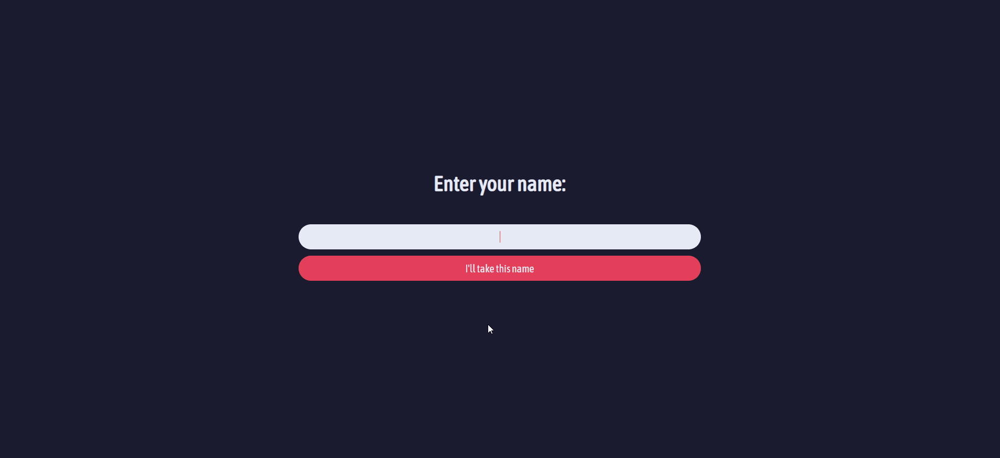
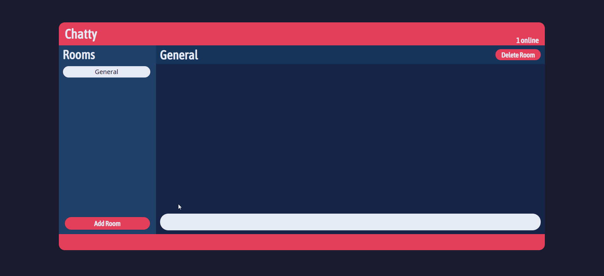
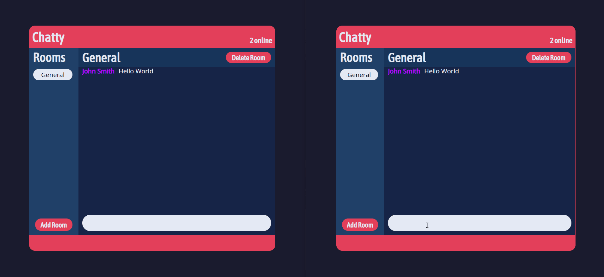
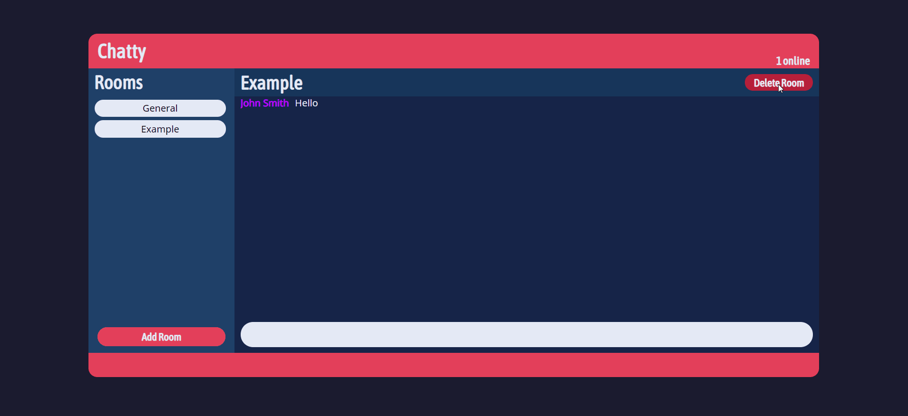

# Chatty
Chat application written with HTML, CSS, and Javascript. This utilizes the Socket.io library as well as the Node.js runtime environment.

* Users are able to join the chat room with an assigned name of their choosing, given that it is available.
* Users are able to create rooms aside from the main chat room with a name of their choosing.
  * Messages sent in each room will only be sent to said room.
  * Messages are stored in a database and will not be lost unless room is deleted or message has expired.
* Users are able to delete rooms.
  * Users in deleted rooms will be sent back to the main chat room.
* All messages older than 20 minutes will be deleted from the database.

 

### Joining Chatty
When joining, users will be prompted to create a name before heading to the chat room.

 

### Sending a Message
To send a message, type into the input field and press enter.

 

### Creating a Room
Rooms can be created by clicking the **Add Room** button on the lower left hand side.

 

### Deleting a Room
Rooms can be deleted by clicking the **Delete Room** button on the upper right hand side.

 

## Installation
To install all required modules, run the following command: `npm install`

 

## Run
To run the code, run the following command: `npm run dev`
